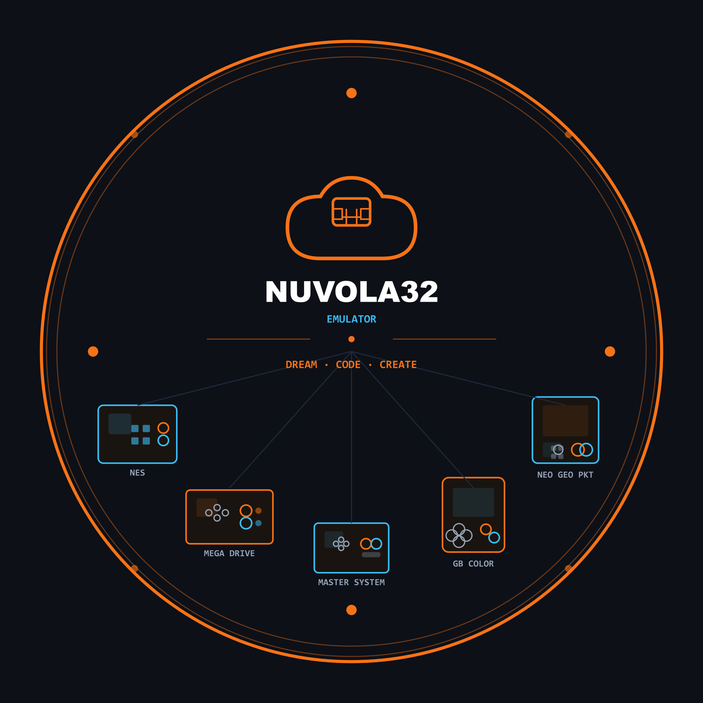

# NUVOLA32 EMU

  

---

NUVOLA32EMU is a Multi Console Emulator.

---

## Features

| Console | Info |
|---|---|
| **Nintendo Entertainment System** | ESP32S3-WROOM-1 N16R8 |
| **Genesis/Mega Drive** | 16 MB |
| **Gameboy Color** | 8 MB |
| **Master System** | Wi-Fi 802.11 b/g/n + Bluetooth 5 / BLE |
| **Neo Geo Pocket Color** | Type-C (CH340C) — Arduino IDE & ESP-IDF compatible |
| **WIFI SD Explorer** | Built-in auto-reset circuit for easy firmware upload |

---

## License

This project uses dual licensing:

- **Firmware & Software** — [MIT License](LICENSE-firmware.md) — use freely, even in commercial projects, just keep the copyright notice.
- **Hardware (schematics, PCB files)** — [CERN OHL v2 Permissive](LICENSE-hardware.md) — open hardware license, derivatives encouraged to credit MakerSun.

---
